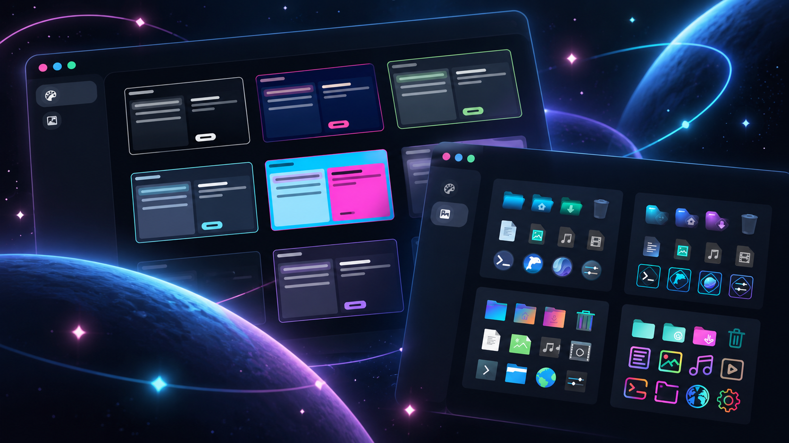
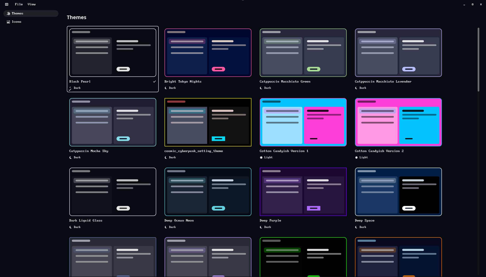
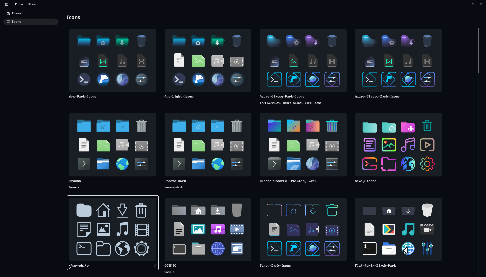

# Stardust

<p align="center">

</p>

Stardust is a COSMIC desktop app for saving, previewing, and switching themes and icon themes.

I made it because switching themes in COSMIC means exporting a `.ron` file and picking it again in Settings every single time. I wanted a grid of my saved themes where I can see what each one looks like and apply it with one click. Then I wanted the same thing for icon themes, so that's in here too.





## What it does

### Themes

- Keeps a library of your saved themes, each one drawn as a tiny COSMIC window using the theme's real colors, corner style, and window hint
- Click a card (or focus it and press Enter) to apply it. Stardust switches between dark and light mode for you when the theme needs it
- A checkmark shows which saved theme your desktop is using, and it stays in sync if you change themes in COSMIC Settings
- Import `.ron` theme files one at a time or a whole folder at once
- The first time you open it, Stardust saves your current theme as "My Theme" so you don't lose it

### Icon themes

- Shows every installed icon theme with 12 of its real icons (folders, files, and a few apps), so you can actually see the difference between them
- Click a card to make it your COSMIC icon theme. Open COSMIC apps switch right away
- Install new icon themes from `.tar` archives (`.tar.gz`, `.tar.xz`, `.tar.bz2`, `.tar.zst`) or from a folder. If a pack has several themes inside, they all get installed
- Cursor-only and hidden themes are left out of the grid

### Card sizes

Pick Small, Medium, or Large cards from the View menu. Stardust remembers your choice.

## Requirements

- The COSMIC desktop (built against COSMIC 1.9, works on 1.7)
- A recent stable Rust toolchain, only if you install with Cargo or build from source (I build with 1.96)
- `tar`, if you want to install icon themes from archives

I use it on CachyOS. It should work on Pop!_OS too, since it only touches your user files in `~/.config/cosmic/` and `~/.local/share/`, but I haven't tested it there yet. If you try it on Pop, I'd love to hear how it goes.

## Install

The quickest way is the install script. It downloads a prebuilt binary for x86_64 Linux into `~/.local/bin`, so you don't need Rust:

```bash
curl --proto '=https' --tlsv1.2 -LsSf https://github.com/pinkpixel-dev/stardust/releases/latest/download/stardust-installer.sh | sh
stardust
```

If you'd rather build it yourself, or you're on a different architecture, install it with Cargo instead:

```bash
cargo install --git https://github.com/pinkpixel-dev/stardust
stardust
```

Either way, the first time you run it, Stardust adds its launcher entry and icon to your user folder, so after that it shows up in the app library and dock like any other app. It updates those files on its own if they ever get out of date (like after reinstalling to a different location).

Stardust isn't on crates.io because libcosmic isn't published there, and crates.io doesn't allow git dependencies.

## Using it

Use the sidebar to switch between the Themes and Icons pages. File > Import works on whichever page is open.

| Shortcut | What it does |
| --- | --- |
| `Ctrl+O` | Import theme files, or an icon theme archive on the Icons page |
| `Ctrl+Shift+O` | Import a folder |
| `Ctrl+=` | Bigger cards |
| `Ctrl+-` | Smaller cards |

## Where your stuff lives

| What | Where |
| --- | --- |
| Saved themes | `~/.local/share/stardust/themes/` (one `.ron` file per theme) |
| Installed icon themes | `~/.local/share/icons/` |
| Stardust's settings | `~/.config/cosmic/dev.pinkpixel.Stardust/` |
| Launcher entry | `~/.local/share/applications/dev.pinkpixel.Stardust.desktop` |
| App icon | `~/.local/share/icons/hicolor/512x512/apps/dev.pinkpixel.Stardust.png` |

Saved themes are written the same way COSMIC Settings exports them, so you can import any of them back into Settings too.

## Things to know

- If you have automatic day/night switching turned on in COSMIC, it can still flip modes later and show whatever theme is in the other slot. Stardust doesn't turn that setting off for you.
- Apps that were already open (including the panel) might not pick up every icon from a theme you just installed until they restart. Stardust tells you when this applies.
- You can't rename or delete themes from the app yet, and installed icon themes can't be removed from it either.
- `.zip` archives aren't supported for icon themes yet.
- There's no theme editor yet. That's the next big thing I'm working on. See [DOCS/ROADMAP.md](DOCS/ROADMAP.md).

## Uninstall

If you used the install script, delete the binary. If you used Cargo, uninstall it with Cargo. Then remove the launcher entry and icon:

```bash
rm ~/.local/bin/stardust    # install script
cargo uninstall stardust    # Cargo
rm ~/.local/share/applications/dev.pinkpixel.Stardust.desktop
rm ~/.local/share/icons/hicolor/512x512/apps/dev.pinkpixel.Stardust.png
```

Your saved themes stay in `~/.local/share/stardust/` in case you want them later. Delete that folder too if you don't.

## Build from source

```bash
git clone https://github.com/pinkpixel-dev/stardust
cd stardust
cargo run --release
```

The launcher entry is only added by release builds, so running a debug build with `cargo run` won't touch your installed one.

## License

Apache-2.0. See [LICENSE](LICENSE).

Made with 💖 by [Pink Pixel](https://pinkpixel.dev)
